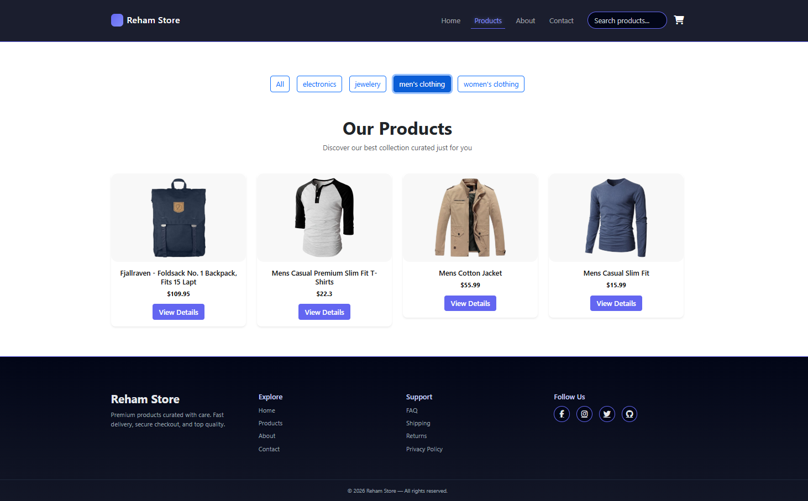
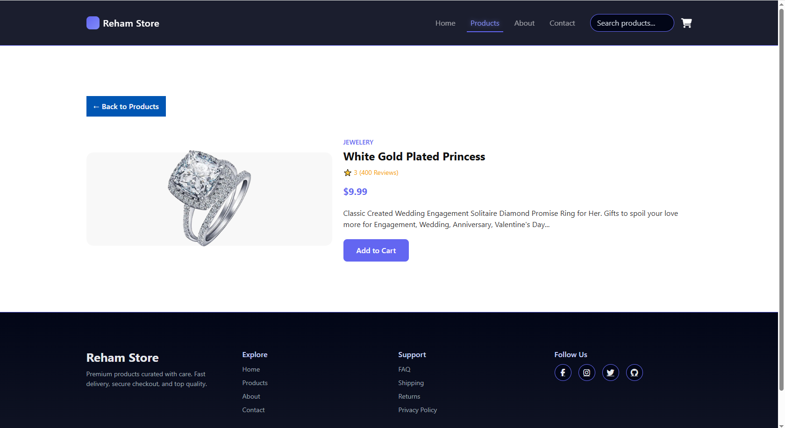

# 🛍️ Reham Store – E-Commerce Web App

**Reham Store** is a modern and responsive **e-commerce web app** built with React.  
It offers a smooth shopping experience with a clean UI and real product data.

---

### 🏠 Home Page


### 🛍️ Products Page


### 📦 Product Details Page


---

## 🚀 Features

- 🛒 Product listing with categories  
- 🔍 Product details with reviews & ratings  
- ✅ Add to cart with SweetAlert2 feedback  
- 📱 Fully responsive (mobile, tablet, desktop)  
- 🌐 Real data from Fake Store API  

---

## 🛠️ Tech Stack

React, React Router, Axios, Context API, Bootstrap, SweetAlert2

---

## 🎨 UI / UX Focus

- Clean and modern card design
- Smooth hover effects and transitions
- User-friendly product details layout
- Clear feedback messages for user actions

---

## 📌 Notes
This project is built for learning and portfolio purposes using public API data.

---

👩‍💻 Author

Reham Ashraf
📎 GitHub: https://github.com/RehamAshraf22
📎 Linkedin: https://www.linkedin.com/in/reham-ashraf-4971b5306/

---

## 🚀 Getting Started

```bash
# Clone the repo
git clone https://github.com/RehamAshraf22/reham-store.git

# Install dependencies
npm install

# Run the project
npm start
